<div align="center">

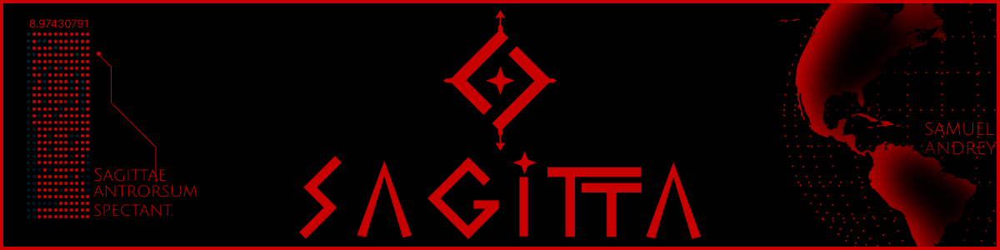

<br><br>

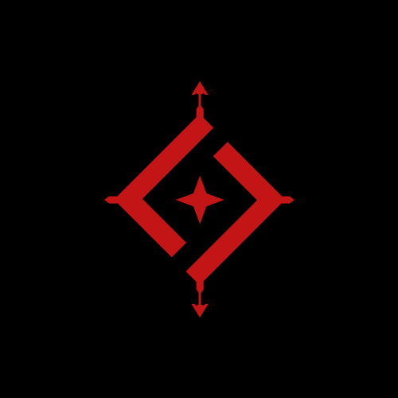

<h1>SAGITTA</h1>

<p><strong>RED NETWORK // DEVELOPMENT DIVISION</strong></p>

</div>

---

<div align="center">

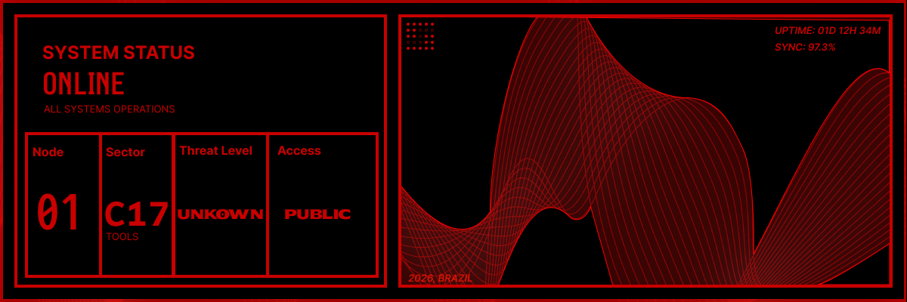

</div>

---

# OVERVIEW

Sagitta is an independent game development studio focused on building memorable interactive experiences through original gameplay, strong visual identity and experimental game design.

Every project is treated as a long-term universe rather than a standalone product.

---

<div align="center">

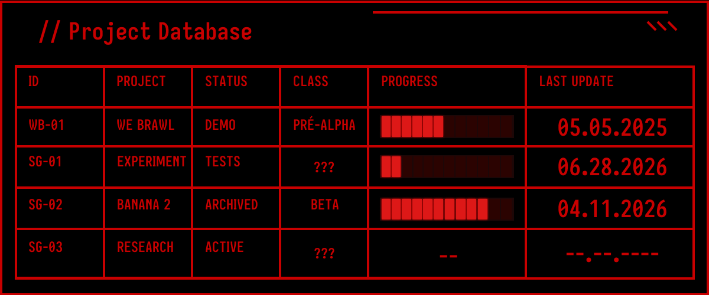

</div>

---

# ACTIVE PROJECTS

<table>

<tr>

<td align="center" width="50%">

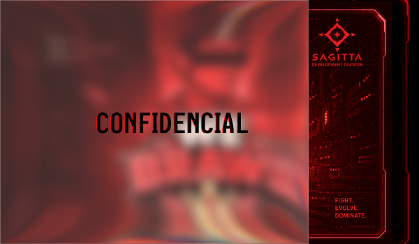

### WE BRAWL

Competitive Action Game

STATUS

`ACTIVE DEVELOPMENT`

</td>

<td align="center" width="50%">

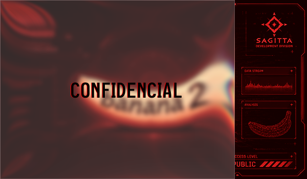

### UNKNOWN PROJECT

REDACTED

STATUS

`CLASSIFIED`

</td>

</tr>

</table>

---

# DEVELOPMENT METRICS

<div align="center">

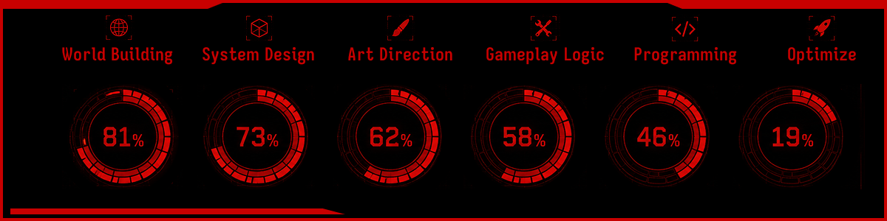

</div>

---

# TECHNOLOGY STACK

<div align="center">

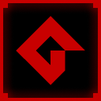

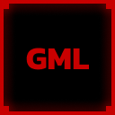

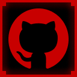

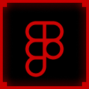

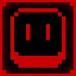

</div>

<br>

<div align="center">

| Engine | Language | Version Control | UI/UX | Pixel Art |
|:------:|:--------:|:---------------:|:------:|:---------:|
| GameMaker | GML | Git | Figma | Aseprite |

</div>

---

# NETWORK

<div align="center">

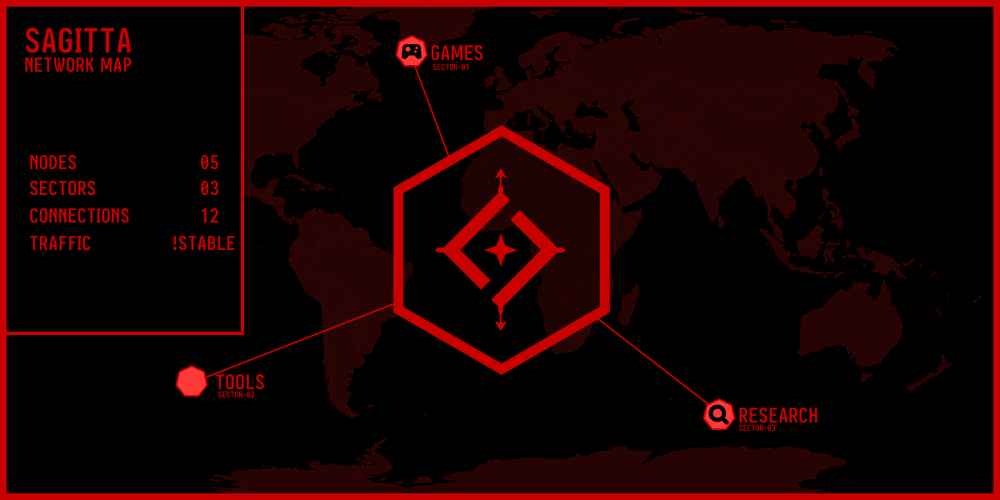

</div>

---

# GITHUB ANALYTICS

<div align="center">


</div>

---

# CURRENT OBJECTIVES

- Expand the Sagitta universe.
- Develop original gameplay systems.
- Publish commercial titles.
- Build a recognizable visual identity.
- Constantly improve development workflow.

---

# REPOSITORIES

| Project | Status |
|----------|--------|
| We Brawl | 🟥 Active |
| Internal Tools | 🟨 Experimental |
| Engine Tests | 🟦 Research |
| Future Projects | ⬛ Classified |

---

<div align="center">

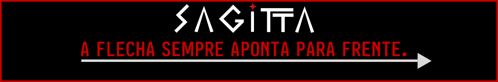

</div>

<div align="center">

```
SAGITTA

BUILD SOMETHING
THAT PEOPLE
WON'T FORGET.
```

</div>
